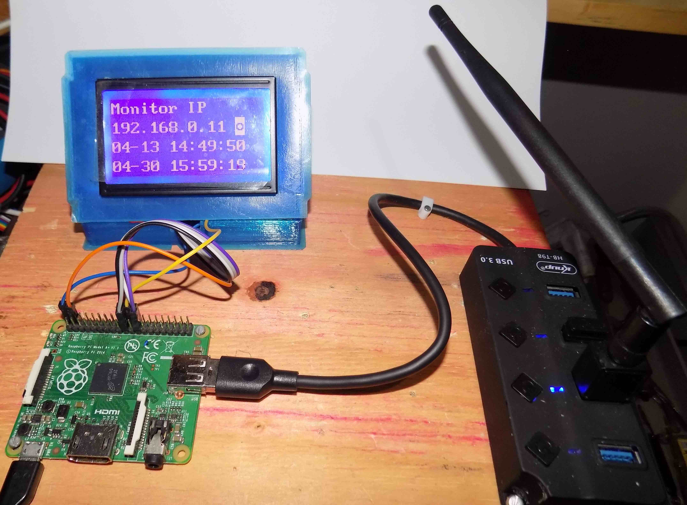

# display_st7920_raspberry
writing to the st7920 lcd display in text mode with Raspberry-Pi

Rudivels@ 11/04/2020

Este programa surgiu da necessidade de fazer um programa simples e direto para 
escrever texto no Display 128x64 ST7920 no modo grafico a partir do Raspberry-Pi.
A grande maioria das bibliotecas disponíveis implementam as funcionalidades gráficas 
do display. Essas bibliotecas não ajudam muito devido a sua complexidade quando é necessário implementar um sistema minima ou fazer depuração de hardware e software.

Por isso resolvi implementar essa versão a partir do zero para escrever no modo texto no display usando o datasheet do ST7920 disponível no  <https://www.digole.com/images/file/Digole_12864_LCD.pdf>.

## Hardware
O hardware é um Raspberry PI modelo A+ com Raspbian instalada e o ST7920 conforme mostrado na foto a seguir. 

O display é configurado para trabalhar no modo serial.

Optou-se em fazer uma versão simples com acesso indiviual aos pinos de entrada e saída para controlar o display, sem usar a porta SPI Raspberry. 
O algoritmo foi baseado na rotina em assembler presente no datasheet do display. 

A única biblioteca extra usado é WiringPi para faciliar o acesso aos pinos de entrada e saída disponível em <http://wiringpi.com/>.

## Pinagem

A pinagen do LCD com os pinos fisicos do Raspberry está na tabela a seguir.
Costuma ter muita confusão a respeito da nomenclatura e numero dos pinos do Raspberry devido a differentes funções que eles podem assumir. No nosso caso apresentamos a númeração física dos pinos do Raspberry e a numeração usado pelo wiringPi.

| LCD       | Função                    |  Raspberry | WiringPi |       
|-----------|:-------------------------:|:----------:|:--------:|
| Pino  1   | Vss                       | pino       | GND      |
| Pino  2   | Vdd                       | pino       | 5 volts  |
| Pino  3   | Vo                        | pino       | 5 volts  |
| Pino  4   | RS ou /CS  chip select    | pino 24    | 10       | 
| Pino  5   | RW ou /SID Sserial data   | pino 19    | 12       | 
| Pino  6   | EN ou /SCLK serial clock  | pino 23    | 14       | 
| Pino 17   | RST                       | pino 22    |  6       | 
| Pino 19   | BLA (backlight Anode)     | pino       | 5 volts  |
| Pino 20   | BLK (backlight Katode     | pino       | GND      |

Uma maneira fácil de conferir a numeração e a configuração é executar na linha do comando do terminal do Rasbian 

$ gpio readall

Veja que escolhemos usar os mesmos pinos do Raspberry que poderiam ser usados para implementar a comunicação como display pelo porta SPI. Entretanto, usamos os pinos como simples portas de saída. Num futuro vamos lançar a versão com SPI aproveitando o hardware já montado.

Não esquece de configurar o hardware do Raspberry de não ativar o SPI. Isso pode ser feito pelo comando 

$ sudo raspi-config

Em seguida seleciona <5 - Interface Options>  e depois desabilita o carregamento do módulo do Kernel de SPI com a opção  <P4 - SPI>

Feito isso, basta baixar os arquivos e rodar o programa.
