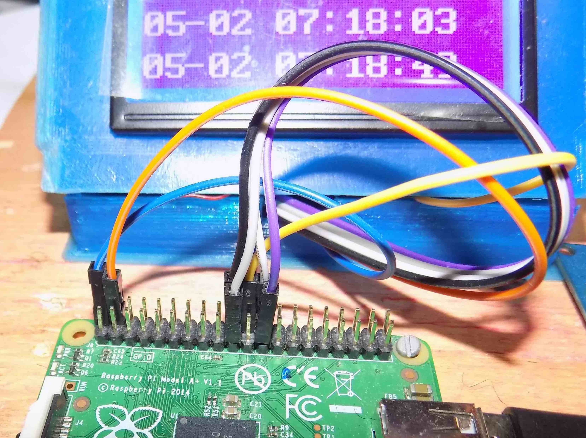

# Display LCD ST7920 no modo texto para Raspberry
Writing to the ST7920 lcd display in text mode with Raspberry-Pi

Rudivels@ 11/04/2020

Este programa surgiu da necessidade de fazer um programa simples e direto para 
escrever texto no Display 128x64 ST7920 no modo grafico a partir do Raspberry-Pi.
A grande maioria das bibliotecas disponíveis implementam as funcionalidades gráficas 
do display. Essas bibliotecas não ajudam muito devido a sua complexidade quando é necessário implementar um sistema minima ou fazer depuração de hardware e software.

Por isso resolvi implementar essa versão a partir do zero para escrever no modo texto no display usando o datasheet do ST7920 disponível no  <https://www.digole.com/images/file/Digole_12864_LCD.pdf>.

## Hardware
O hardware é um Raspberry PI modelo A+ com Raspbian instalada e o ST7920 conforme mostrado na foto a seguir. 


O display é configurado para trabalhar no modo serial.

Optou-se em fazer uma versão simples com acesso indiviual aos pinos de entrada e saída para controlar o display, sem usar a porta SPI Raspberry. 
O algoritmo foi baseado na rotina em assembler presente no datasheet do display. 

A única biblioteca extra usado é WiringPi para faciliar o acesso aos pinos de entrada e saída disponível em <http://wiringpi.com/>.


## Pinagem


Costuma ter muita confusão a respeito da nomenclatura e numero dos pinos do Raspberry devido a differentes funções que eles podem assumir. No nosso caso apresentamos a númeração física dos pinos do Raspberry e a numeração usado pelo wiringPi.

A pinagen do LCD com os pinos fisicos do Raspberry está na tabela a seguir.


| LCD       | Função                    |  Raspberry | WiringPi |       
|-----------|:-------------------------:|:----------:|:--------:|
| Pino  1   | Vss                       | pino 20    | GND      |
| Pino  2   | Vdd                       | pino  2    | 5 volts  |
| Pino  3   | Vo                        | pino  2    | 5 volts  |
| Pino  4   | RS ou /CS  chip select    | pino 24    | 10       | 
| Pino  5   | RW ou /SID Sserial data   | pino 19    | 12       | 
| Pino  6   | EN ou /SCLK serial clock  | pino 23    | 14       | 
| Pino 17   | RST                       | pino 22    |  6       | 
| Pino 19   | BLA (backlight Anode)     | pino  2    | 5 volts  |
| Pino 20   | BLK (backlight Katode)    | pino 20    | GND      |

Uma maneira fácil de conferir a numeração e a configuração é executar na linha do comando do terminal do Raspbian 

```
$ gpio readall
```

Veja que escolhemos usar os mesmos pinos do Raspberry que poderiam ser usados para implementar a comunicação como display pelo porta SPI. Entretanto, usamos os pinos como simples portas de saída. Num futuro vamos lançar a versão com SPI aproveitando o hardware já montado.

Não esquece de configurar o hardware do Raspberry de não ativar o SPI. Isso pode ser feito pelo comando 

```
$ sudo raspi-config
```


Em seguida seleciona <5 - Interface Options>  e depois desabilita o carregamento do módulo do Kernel de SPI com a opção  <P4 - SPI>

Feito isso, basta baixar os arquivos e rodar o programa.

## Rodar o programa
No repositório temos os arquivos 
`lib_st7920textmode.c` e
`lib_st7920textmode.h` que contem a biblioteca com as funções báscas de acesso ao display. 

O primeiro passo é configurar os pinos do Raspberry que vão ser usados para acionar o display. Neste exemplo os pinos escolhidos foram

| Função | Wiring Pi |pinos |
|--------|:-----:|:--------:|
| CS     | 10    | pino 24  |
| SID    | 12    | pino 19  |
| SCLK   | 14    | pino 23  |
| RESET  |  6    | pino 22  |

Os detalhes da conexão está na figura a seguir.



.

Há uma função na biblioteca que passa os pinos para configurar o Raspberry. Os pinos são repassados na sequencia , como mostrado a seguir:

**void config\_pinos\_rasp\_lcd(CS, SID, SCLK, RESET);**

As demais funções na biblioteca são triviais.


O script para compilar as bibliotecas com um arquivo está no `makefile`

O programa usado aqui como exemplo está no arquivo `monitor.c` e é uma rotina que a cada 5 segundos verifique se a conexão TCP/IP ainda está ativa e escreve o endereço do IP no display. 

Este programa é muito útil quando vc trabalho com uma configuração mínima do Raspberry sem display e teclado e você precisa acessar o Raspberry via ssh. 

Uma dica. Coloca o programa para ser executado pelo CRON cada vez que o sistema da boot.
Para isso, adiciona no CRONTAB a linha 

`@reboot nohup /"caminho_onde_se_encontra_seu_programa"/monitor &
`